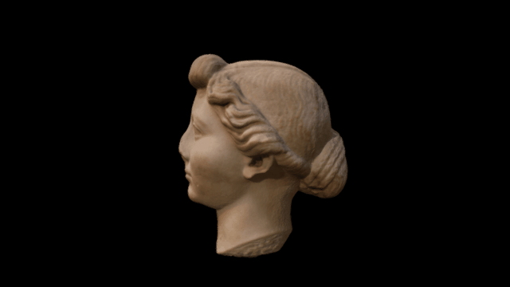

 

# A 3D model of the bust of Livia, gallery 70

3D data for recreation of a British Museum object.

A scan of a marble head of Livia. 

(The pole supporting the bust was hard to model due to the high polish and the base is obscured by the supporting pillar.)

On display: G70

British Museum Collection Online Link: http://bit.ly/liviaBM

Model by Daniel Pett with a Canon DSLR and Photoscan.

# LICENSE

The contents of this repository are licensed under CC-BY-NC-SA

# Credits

Photographs and models by Daniel Pett <dpett@britishmuseum.org>, Digital Humanities Lead, British Museum
